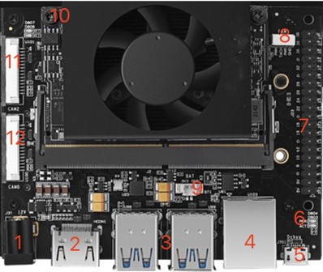

# Interface Description

The RDK Ultra development kit provides various peripheral interfaces such as Ethernet, USB, HDMI, MIPI CSI, and 40PIN, making it convenient for users to experience and develop the RDK Ultra development kit. The interface layout is as follows:

 

| No.  | Interface Function | No.  | Interface Function        | No.  | Interface Function       |
| ---- | ----------------- | ---- | ----------------------- | ---- | ---------------------- |
| 1    | Power Interface        | 7    | 40pin header                     | 13   | CAM3 interface, 24PIN, 4lane     |
| 2    | HDMI Display Interface        | 8    | PWM Fan Interface                    | 14   | CAM1 interface, 24PIN, 4lane       |
| 3    | 4 USB 3.0 Interfaces   | 9    | rtc Battery Interface                        | 15   | Wireless Network Card Interface, PCIe M.2-E    |
| 4    | Gigabit Ethernet Port     | 10   |  Function Control Interface                      | 16   | SSD Hard Disk Interface, PCIe M.2-M     |
| 5    | Debug Interface         | 11   | CAM2 interface, 15PIN, 2lane            | 17   | SSD Hard Disk Interface, PCIe M.2-M        |
| 6    | Status Indicator       | 12   | CAM0 interface, 15PIN, 2lane             |  |  |

## Power Interface

The RDK Ultra development board is powered by a DC interface, and it is recommended to use the power adapter provided with the kit or use a power adapter with at least **12V/5A**. After connecting the power, if the red power indicator (Interface 6) lights up, it means that the device is powered normally.

## HDMI Interface

The RDK Ultra development board provides an HDMI display interface (Interface 2), supporting up to 1080P resolution. After the development board is powered on, the Ubuntu GUI will be output through the HDMI interface. With specific sample programs, the HDMI interface also supports the preview display of cameras and video streams.

Currently, the HDMI interface only supports the 1080p60 display mode, and more display modes will be supported in future software versions.

## MIPI CSI Interface

The RDK Ultra development board provides four camera interfaces, named `CAM 0~3`, which can simultaneously connect to four MIPI Camera modules. The usage notes are as follows:

1. CAM 0/2 (Interfaces 11/12) use a 15-pin FPC connector and support the connection of Raspberry Pi OV5647, IMX219, IMX477, and other Camera modules.
2. CAM 1/3 (Interfaces 13/14) use a 24-pin FPC connector and support the connection of F37, GC4663, IMX415, and other Camera modules.

The specifications of the camera modules are as follows:

| No.  | Sensor | Resolution | FOV              | I2C Device Address |
| ---- | ------ | ------ | ---------------- | ------------ |
| 1    | GC4663 | 400W   | H:104 V:70 D:113 | 0x29         |
| 2    | JXF37  | 200W   | H:62  V:37 D:68  | 0x40         |
| 3    | IMX219 | 800W   | H:62  V:37 D:68  | 0x10         |
| 4    | IMX477 | 1200W  | H:62  V:37 D:68  | 0x1a         |
| 5    | OV5647 | 500W   | H:62  V:37 D:68  | 0x36         |

The purchasing method for camera modules can be found on the community accessory page, [Purchase Link](https://developer.horizon.cc/accessory).

:::caution NoteImportant Reminder: It is strictly prohibited to plug or unplug the camera module while the development board is powered on, as it may easily damage the camera module.

## USB Interface

The RDK Ultra development board provides four USB3.0 standard interfaces (Interface 3), which can support up to four USB peripherals to be connected simultaneously. Please note that the USB interfaces of RDK Ultra only support Host mode.

## Debug Interface {#debug_uart}

The RDK Ultra development board is equipped with one debug interface (Interface 5). The debug UART of the core module is converted to a USB interface via the `CH340` chip on the hardware. Users can utilize this interface for various debugging purposes. The settings for the computer's serial port tool should be configured as follows:

- Baud rate: 921600
- Data bits: 8
- Parity: None
- Stop bits: 1
- Flow control: None

Usually, when using this interface for the first time, users need to install the CH340 driver on their computers. Users can search for the keyword "CH340 serial port driver" for downloading and installation.

## Function Control Interface

The RDK Ultra development board provides a set of function control interfaces (Interface 10), which can be used to control the functional modes of the core module. The pin definitions for the function control interfaces are as follows:

| Pin Number | Pin Name | Function Description | Usage |
| ------ | -------- | ------------------------------ | ----------------------------------- |
| 1      | WAKE_UP  | Used to wake up the development board                 | Connect with GND using a jumper cap                      |
| 2      | GND      | Ground Signal                        | GND                                     |
| 3      | FC_REC   | Forcing the development board to enter recovery mode      | Connect with GND using a jumper cap                     |
| 4      | GND      | Ground Signal                        |  GND                                    |
| 5      | SYS_RST  | Used for system reset                   | Connect with GND using a jumper cap and then disconnect to perform system reset        |
| 6      | GND      | Ground Signal                        | GND                                      |
| 7      | PWR_EN   | Power enable signal                   | Connect with GND using a jumper cap to turn off the power supply for the core board        |
| 8      | GND      | GDN                          | GND                                 |

  

## 40-pin Header Interface

The RDK Ultra development board provides a 40-pin header interface (Interface 7), which supports various interfaces such as GPIO, UART, I2C, SPI, I2S, etc. The detailed pin definitions and multiplexing relationships are as follows:

