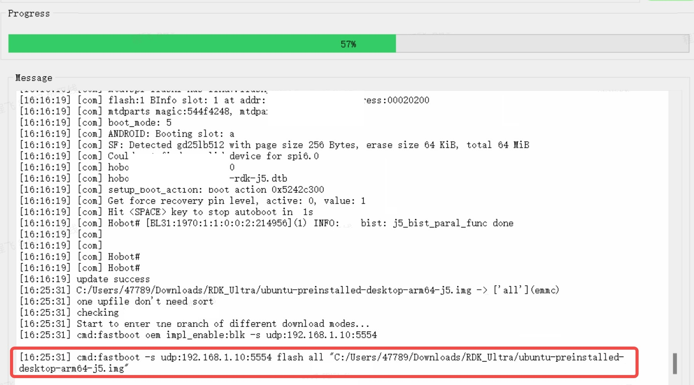
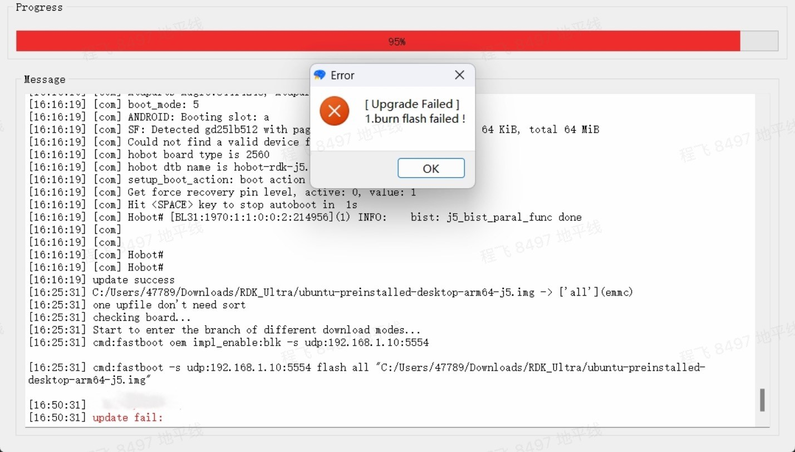

# System Flashing

:::tip

For the complete steps of downloading and flashing the system image, please [**click here to view this section**](/installation/install_os).

:::

When flashing the Ubuntu system on the RDK Ultra development kit, you need to use the Horizon `hbupdate` flashing tool. Currently, the tool supports two versions: Windows and Linux, which start with `hbupdate_win64` and `hbupdate_linux` respectively. You can download the tool from this link: [hbupdate](http://sunrise.horizon.cc/downloads/hbupdate/).

Here are some notes for using the tool:
- Unzip the compressed package and make sure the extraction path does not contain **spaces, Chinese characters, special characters**, etc.
- The tool communicates with RDK Ultra through the Ethernet interface. To ensure the flashing speed, please make sure that **your PC supports Gigabit Ethernet and use a direct connection**.
- The network on the PC side needs to be configured in **static IP mode**. The specific settings are as follows:
  - IP: 192.168.1.195
  - netmask: 255.255.255.0
  - gateway: 192.168.1.1

## Flashing Steps{#flash_system}

1) Connect RDK Ultra to your PC using an Ethernet cable and ensure that the network is pingable.

2) Short the `FC_REC` and `GND` signals of the function control interface (Interface 10).

3) Run the `hbupdate` main program, open the flashing tool, and choose the development board model as `RDK_ULTRA`, which is a necessary setting.

4) Click the `Browse` button to choose the image file you want to flash, which is a necessary setting.

5) Click the `Start` button to start the flashing. After confirming the operation, click the `OK` button:

6) When the tool displays the following output, it means that the flashing process has started. Please be patient as the duration depends on the network transmission speed.

7) Wait for the tool to finish the upgrade and check the upgrade result.

- When the image flashing is successful, the tool will display the following prompt:- When the tool prompts the following error, please verify if steps 1~3 are performed correctly.

- When the tool prompts the following error, it indicates that the network transmission speed is too slow. It is recommended to replace the PC with better performance and upgrade again.
