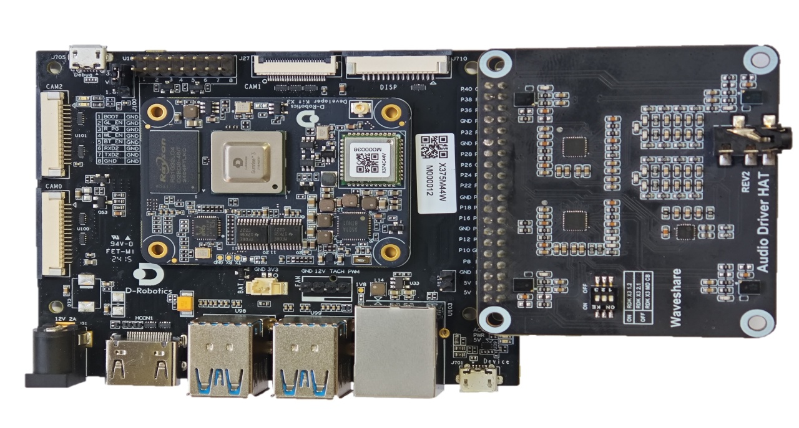

# How to use audio breakout board

Currently, the RDK X3 Module supports two audio breakout boards: the Audio Driver HAT and the WM8960 Audio HAT. These boards are used to meet the functional requirements of different voice scenarios. The following will provide detailed instructions on how to use these two audio boards.

:::note Note

If you are prompted that the Miniboot version is not the latest after installing the driver, please go to `1 System Options` -> `S7 Update Miniboot` to update Miniboot.

:::

## Audio Driver HAT REV2

### Product Introduction

The Audio Driver HAT REV2 is an audio breakout board produced by Waveshare Electronics. It uses the ES7210+ES8156 dual Codec solution and can achieve functions such as circular 4 MIC recording, dual-channel audio playback, and audio signal capture. The appearance of the breakout board is shown in the following image:


For more details about the audio breakout board, please refer to [Audio Driver HAT](https://www.waveshare.net/shop/Audio-Driver-HAT.htm).

### Installation Method

1. Connect the breakout board to the 40pin header of the RDK X3 Module as shown in the following image:
  
And set all the DIP switches to **off**.


2. Configure the audio board using `srpi-config`  
Go to `3 Interface Options` -> `I5 Audio`  
Choose `Audio Driver HAT V2`:
  


3. Run the command `sync && reboot` to restart the development board. If the following device nodes appear in `/dev/snd`, it means that the breakout board is successfully installed.
    ```shell
    root@ubuntu:/userdata# ls /dev/snd
    by-path  controlC0  pcmC0D0p  pcmC0D1c  timer
    ```

### Uninstallation Method

1. Configure the audio board using `srpi-config`   
Go to `3 Interface Options` -> `I5 Audio`  
Choose `UNSET` to uninstall the audio driver and related configurations.

### Audio NodesThe audio playback node for the `RDK X3` on this audio board is `pcmC0D1p`, and the recording node is `pcmC0D0c`.

### Audio Recording and Playback Testing

The `tinyalsa` library is used for testing and includes the following tools: `tinycap` for recording and `tinyplay` for playback.

Instructions for using `tinycap`:
```shell
tinycap
Usage: tinycap {file.wav | --} [-D card] [-d device] [-c channels] [-r rate] [-b bits] [-p period_size] [-n n_periods] [-t time_in_seconds]

Use -- for filename to send raw PCM to stdout
```
Instructions for using `tinyplay`:
```shell
tinyplay
usage: tinyplay file.wav [options]
options:
-D | --card   <card number>    The device to receive the audio
-d | --device <device number>  The card to receive the audio
-p | --period-size <size>      The size of the PCM's period
-n | --period-count <count>    The number of PCM periods
-i | --file-type <file-type >  The type of file to read (raw or wav)
-c | --channels <count>        The amount of channels per frame
-r | --rate <rate>             The amount of frames per second
-b | --bits <bit-count>        The number of bits in one sample
-M | --mmap                    Use memory mapped IO to play audio
```
If you want to learn more about the `tinyalsa` library, please visit their [repository](https://github.com/tinyalsa/tinyalsa).

- 2-channel microphone recording:

```
tinycap ./2chn_test.wav -D 0 -d 0 -c 2 -b 16 -r 48000 -p 512 -n 4 -t 5
```

- 4-channel microphone recording:

```
tinycap ./4chn_test.wav -D 0 -d 0 -c 4 -b 16 -r 48000 -p 512 -n 4 -t 5
```

- Playback of stereo audio:

```
tinyplay ./2chn_test.wav -D 0 -d 1
```

### Audio Resampling Testing

The playback and capture signals of this audio board are using recording channels 7&8, so the 8-channel recording command needs to be used for capturing.

- Start 8-channel microphone recording
```shell
tinycap ./8chn_test.wav -D 0 -d 0 -c 8 -b 16 -r 48000 -p 512 -n 4 -t 5
```

- Start dual-channel audio playback
```
tinyplay ./2chn_test.wav -D 0 -d 1
```

After recording is complete, you can use audio software to view the spectrum information of channels 7&8 in the `2chn_test.wav` file.

### Notes

The RDK X3 Module does not support the old version Audio Driver HAT REV1 audio board. Please upgrade to the REV2 version for use.

## WM8960 Audio HAT

### Product Introduction

WM8960 Audio HAT is an audio adapter board produced by Waveshare Electronics. It adopts WM8960 Codec solution and can achieve dual-channel microphone recording and audio playback functions. The appearance of the adapter board is as shown in the figure below:


For detailed information about the audio adapter board, please refer to [WM8960 Audio HAT](https://www.waveshare.net/wiki/WM8960_Audio_HAT).

### Installation Method

1. Connect the adapter board to the 40-pin header of RDK X3 as shown in the figure below:


2. Configure the audio board using `srpi-config`:
Enter `3 Interface Options`->`I5 Audio` and select `WM8960 Audio HAT`:


3. Run the command `sync && reboot` to restart the development board. If the following device nodes appear under `/dev/snd`, it indicates that the adapter board is successfully installed:
    ```shell
    root@ubuntu:~# ls /dev/snd/
    by-path  controlC0  pcmC0D0c  pcmC0D0p  pcmC0D1c  pcmC0D1p  timer
    ```

### Uninstallation Method
1. Configure the audio board using `srpi-config`:
Enter `3 Interface Options`->`I5 Audio` and select `UNSET` to uninstall the audio driver and related configurations.

### Audio Nodes
The playback node for this audio board on `RDK X3` is `pcmC0D0p`, and the recording node is `pcmC0D1c`.

### Recording and Playback Test

To perform the test, we will be using the toolset provided by the `tinyalsa` library: `tinycap` for recording and `tinyplay` for playback.

Usage instructions for `tinycap`:
```shell
tinycap
Usage: tinycap {file.wav | --} [-D card] [-d device] [-c channels] [-r rate] [-b bits] [-p period_size] [-n n_periods] [-t time_in_seconds]

Use -- for filename to send raw PCM to stdout
```
Usage instructions for `tinyplay`:
```shell
tinyplay
usage: tinyplay file.wav [options]
options:
-D | --card   <card number>    The device to receive the audio
-d | --device <device number>  The card to receive the audio
-p | --period-size <size>      The size of the PCM's period
-n | --period-count <count>    The number of PCM periods
-i | --file-type <file-type >  The type of file to read (raw or wav)
-c | --channels <count>        The amount of channels per frame
-r | --rate <rate>             The amount of frames per second
-b | --bits <bit-count>        The number of bits in one sample
-M | --mmap                    Use memory mapped IO to play audio
```
For more information about the `tinyalsa` library, please refer to their [repository](https://github.com/tinyalsa/tinyalsa).


- 2-channel microphone recording:

```
tinycap ./2chn_test.wav -D 0 -d 1 -c 2 -b 16 -r 48000 -p 512 -n 4 -t 5
```

- Dual-channel audio playback:

```
tinyplay ./2chn_test.wav -D 0 -d 0
```

## Coexisting Audio Sub-board and USB Sound Card

If you have a USB sound card and want it to coexist with the above-mentioned audio sub-board, please follow the tutorial below:

1. Make sure the audio sub-board is enabled according to the instructions above.

2. Connect the USB sound card and observe the newly added nodes under `/dev/snd` after the driver is loaded. Taking the WM8960 + USB full-duplex sound card as an example,

```
    root@ubuntu:~# ls /dev/snd/
    by-path  controlC0  pcmC0D0c  pcmC0D0p  pcmC0D1c  pcmC0D1p  pcmC1D0c  pcmC1D0p  timer
```

the nodes `pcmC1D0c pcmC1D0p` represent the USB sound card node, which is shared by full-duplex.

3. Modify `/etc/pulse/default.pa` and add the corresponding node information below `load-module module-alsa-source`:
```apacheconf
...

.ifexists module-udev-detect.so
load-module module-alsa-sink device=hw:0,1 mmap=false tsched=0 fragments=2 fragment_size=960 rate=48000 channels=2 rewind_safeguard=960
load-module module-alsa-source device=hw:0,0 mmap=false tsched=0 fragments=2 fragment_size=960 rate=48000 channels=2
load-module alsa device=hw:1,0 #corresponding to the above node
load-module module-alsa-source device=hw:1,0 #corresponding to the above node
.else

...
```

4. Save the configuration and restart the development board.